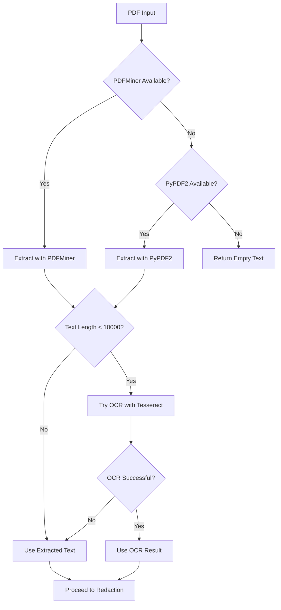
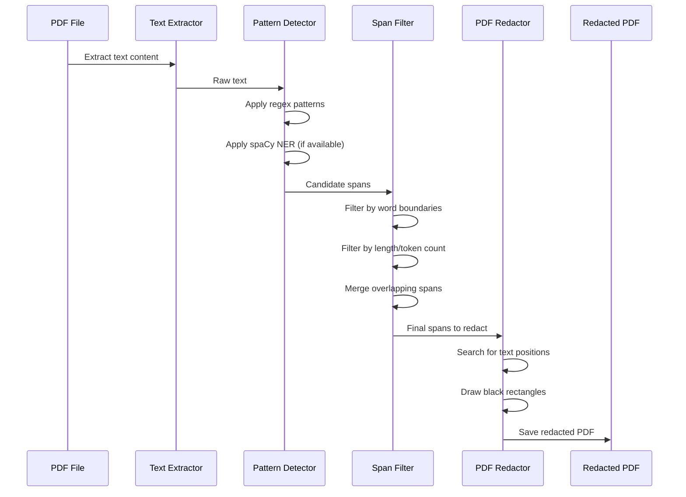
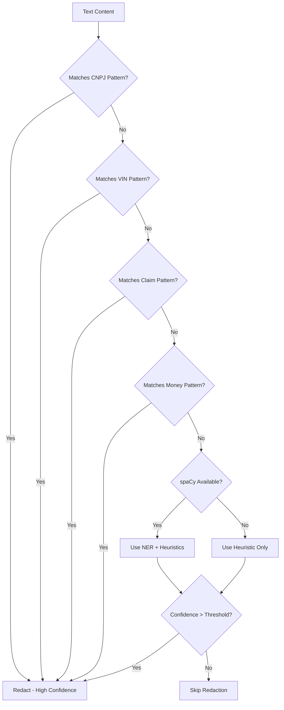
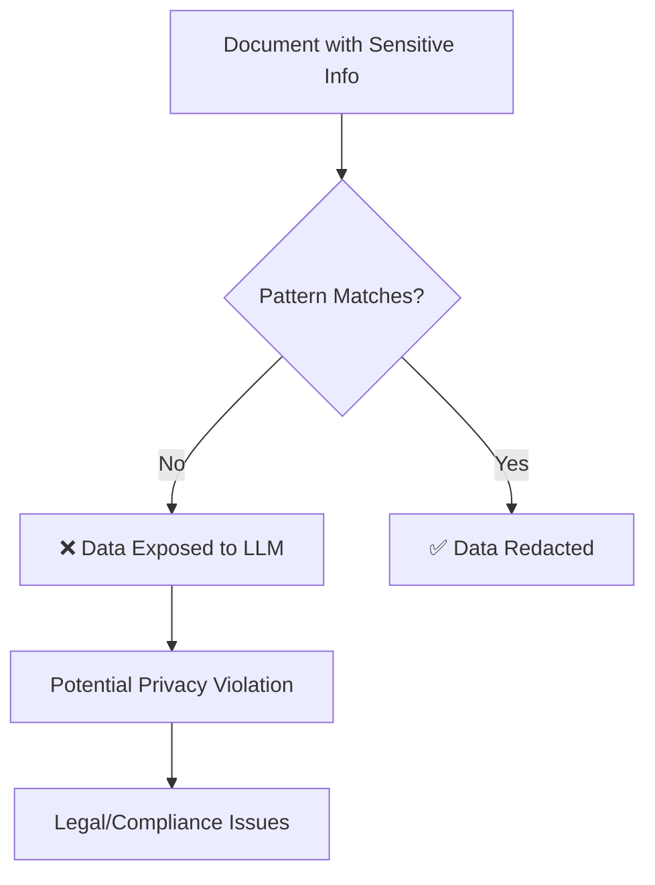
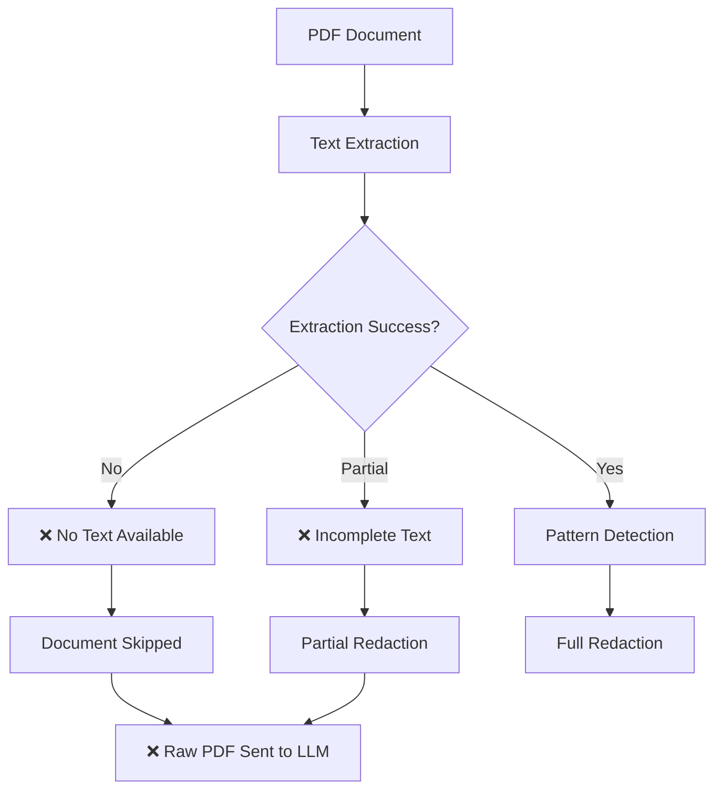
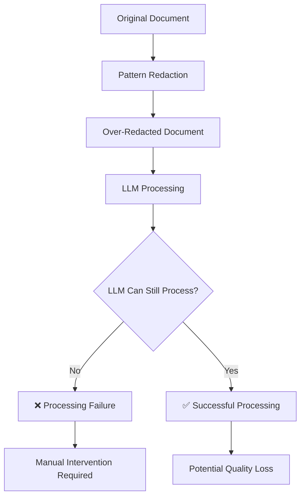

# PDF Redaction Analysis: Data Sensitization for LLM Processing

## Overview

The `redact_pdf_text` function in `data_sensitization.py` implements a sophisticated approach to redacting sensitive business information from PDF files before sending them to LLMs. This analysis explores the logic, addresses the apparent paradox of redaction, and explains how the system handles the challenge of identifying sensitive data without LLM assistance.

## Core Challenge: The Redaction Paradox

**The Problem**: If we don't send the PDF to an LLM, how do we know which fields contain sensitive information to redact?

**The Solution**: The system uses a multi-layered approach combining:
1. **Pattern-based detection** using regex for structured data
2. **Statistical analysis** of document content
3. **Domain-specific knowledge** about Brazilian business documents
4. **Conservative redaction** that errs on the side of over-redaction

## How the Redaction Logic Works

### 1. Text Extraction Pipeline

The system first extracts text from PDFs using multiple fallback methods:



### 2. Sensitive Data Detection Strategy

The system detects sensitive information using a **pattern-first approach** rather than semantic understanding:

#### A. Structured Data Patterns (High Confidence)
- **CNPJ**: Brazilian company tax IDs with specific formats
- **VIN**: Vehicle identification numbers with standardized structure
- **Claim Numbers**: Insurance claim IDs with predictable patterns (BYDAMEBR...WCN...)
- **Vehicle Plates**: Brazilian license plate formats
- **Money**: Currency amounts with decimal patterns

#### B. Semi-Structured Data (Medium Confidence)
- **Names**: Uses spaCy NER + Brazilian name database
- **Organizations**: Pattern matching for company suffixes (S.A., LTDA, etc.)
- **Addresses**: Keyword-based detection for street names and locations

### 3. Redaction Process Flow



## Addressing the Core Question

### Why This Approach Works Despite the Paradox

**1. Pattern Recognition vs. Semantic Understanding**
- The system doesn't need to understand *what* the data represents
- It only needs to recognize *patterns* that typically contain sensitive information
- Example: Any 14-digit number in CNPJ format is redacted, regardless of context

**2. Conservative Redaction Strategy**
- The system errs on the side of over-redaction rather than under-redaction
- Better to redact too much than to expose sensitive data
- False positives are acceptable; false negatives are dangerous

**3. Domain-Specific Knowledge**
- The patterns are tailored to Brazilian business documents
- Common document types (invoices, claims, contracts) have predictable structures
- The system leverages this domain knowledge to make educated guesses

### 4. Redaction Decision Matrix



## Technical Implementation Details

### Pattern-Based Detection Examples

```python
# CNPJ patterns (multiple formats)
CNPJ_PATTERNS = [
    re.compile(r"(?<!\d)\d{2}\.\d{3}\.\d{3}/\d{4}-\d{2}(?!\d)"),  # 12.345.678/0001-90
    re.compile(r"(?<!\d)\d{8}/\d{4}-\d{2}(?!\d)"),                 # 12345678/0001-90
    re.compile(r"(?<!\d)\d{14}(?!\d)"),                            # 12345678000190
]

# Claim numbers (insurance-specific)
CLAIM_NO_REGEX_STRICT = re.compile(
    r"BYDAMEBR(?P<body>(?=[A-Za-z0-9]*WCN)(?![A-Za-z0-9]*WRO)[A-Za-z0-9]{8,30})_(?P<suffix>\d{2})",
    re.IGNORECASE,
)
```

### Quality Control Mechanisms

1. **Word Boundary Validation**: Ensures patterns don't match partial words
2. **Length Filtering**: Avoids redacting very short or very long spans
3. **Overlap Resolution**: Merges overlapping redaction areas
4. **Fallback Strategies**: Multiple extraction methods ensure text is captured

## Limitations and Trade-offs

### What the System Does Well
- ✅ Handles structured data excellently (IDs, numbers, codes)
- ✅ Conservative approach prevents data leakage
- ✅ Fast processing without LLM dependency
- ✅ Domain-specific optimization for Brazilian documents

### What the System Struggles With
- ❌ Context-dependent sensitive information
- ❌ Handwritten or poorly scanned documents
- ❌ Unusual document formats
- ❌ Subtle semantic relationships between fields

### False Positive/False Negative Balance
- **False Positives**: Common but acceptable (over-redaction)
- **False Negatives**: Rare but critical (data exposure)
- The system is designed to minimize false negatives at the cost of more false positives

## Critical Risks and Cons of This Approach

### 🚨 High-Risk Scenarios

#### 1. **False Negatives - Data Exposure Risk**
**Risk Level: CRITICAL**



**Examples of High-Risk False Negatives:**
- **Non-standard formats**: CNPJ written as "Company ID: 12345678" (missing dots/dashes)
- **Handwritten numbers**: Manual entries that don't match regex patterns
- **Obfuscated data**: Sensitive info intentionally formatted differently
- **New document types**: Unknown formats not covered by existing patterns

**Impact**: Complete privacy failure - sensitive data sent to external LLM

#### 2. **Pattern Evolution Risk**
**Risk Level: HIGH**

- **New document formats**: Insurance companies, banks, government agencies frequently change document layouts
- **Pattern drift**: What works today may not work tomorrow
- **Maintenance burden**: Requires constant pattern updates and testing
- **Silent failures**: Patterns that stop working without obvious indicators

#### 3. **OCR and Text Extraction Failures**
**Risk Level: HIGH**



**Failure Scenarios:**
- **Scanned images**: Poor quality scans with no text layer
- **Complex layouts**: Tables, forms, multi-column documents
- **Encrypted PDFs**: Password-protected or encrypted documents
- **Corrupted files**: Damaged PDFs that can't be processed

#### 4. **Context-Dependent Sensitive Information**
**Risk Level: MEDIUM-HIGH**

**Examples the system cannot detect:**
- "The customer John Smith (our VIP client) called about invoice #12345"
- "Please process the claim for the accident at Main Street intersection"
- "The vehicle with license plate ABC-1234 was involved in a hit-and-run"

**Why it's risky:**
- Sensitive information embedded in narrative text
- Requires semantic understanding to identify
- Common in customer service notes, incident reports, legal documents

### 💰 Operational and Business Risks

#### 1. **Over-Redaction Impact on LLM Performance**
**Risk Level: MEDIUM**



**Business Impact:**
- **Reduced accuracy**: LLM gets less context for analysis
- **Processing failures**: Over-redacted documents may become unreadable
- **Manual overhead**: Requires human review of redacted documents
- **Quality degradation**: Important context lost due to aggressive redaction

#### 2. **Maintenance and Scalability Issues**
**Risk Level: MEDIUM**

**Challenges:**
- **Pattern complexity**: Regex patterns become increasingly complex and fragile
- **Testing burden**: Each pattern change requires extensive testing
- **Performance degradation**: Complex regex patterns slow down processing
- **Knowledge dependency**: Requires domain experts to maintain patterns

#### 3. **Compliance and Audit Risks**
**Risk Level: HIGH**

**Regulatory Concerns:**
- **Incomplete redaction**: May not meet GDPR, CCPA, or industry-specific requirements
- **Audit trail gaps**: Difficult to prove what was redacted and why
- **Consistency issues**: Different redaction results for similar documents
- **Legal liability**: False negatives could result in data breach penalties

### 🔧 Technical Risks

#### 1. **Dependency on External Libraries**
**Risk Level: MEDIUM**

**Vulnerabilities:**
- **PyMuPDF**: PDF processing library with potential security issues
- **Tesseract OCR**: Command-line tool requiring system access
- **spaCy**: Large language models requiring significant resources
- **Version conflicts**: Library updates may break existing functionality

#### 2. **Performance and Resource Issues**
**Risk Level: MEDIUM**

**Bottlenecks:**
- **OCR processing**: Slow and resource-intensive for large documents
- **Pattern matching**: Complex regex patterns can be computationally expensive
- **Memory usage**: Large documents and OCR images consume significant memory
- **Scalability**: May not handle high-volume document processing efficiently

#### 3. **Error Handling and Recovery**
**Risk Level: MEDIUM-HIGH**

**Failure Modes:**
- **Silent failures**: Errors that don't raise exceptions but produce incorrect results
- **Partial processing**: Documents that are partially redacted
- **Resource exhaustion**: Memory or disk space issues during processing
- **Inconsistent results**: Same document producing different redaction results

### 🎯 Mitigation Strategies

#### 1. **For False Negatives**
- **Regular pattern audits**: Test against new document samples
- **Human review sampling**: Random checks of redacted documents
- **Multi-pass detection**: Use multiple detection methods
- **Whitelist approach**: Process only known, tested document types

#### 2. **For Over-Redaction**
- **Confidence scoring**: Only redact high-confidence matches
- **Context preservation**: Maintain document structure and formatting
- **Selective redaction**: Redact only the most sensitive patterns
- **LLM feedback**: Use LLM output quality as redaction effectiveness metric

#### 3. **For Technical Risks**
- **Comprehensive testing**: Automated tests for pattern changes
- **Monitoring and alerting**: Track redaction success rates
- **Fallback mechanisms**: Multiple extraction and redaction methods
- **Documentation**: Clear procedures for pattern maintenance

### ⚖️ Risk-Benefit Analysis

**When This Approach is Appropriate:**
- ✅ Well-structured business documents (invoices, claims, contracts)
- ✅ Consistent document formats from known sources
- ✅ High-volume, standardized document processing
- ✅ Strong regulatory requirements for data protection

**When to Consider Alternatives:**
- ❌ Highly variable document formats
- ❌ Documents with significant handwritten content
- ❌ Legal or medical documents requiring precise understanding
- ❌ Low-volume, high-value document processing

**Alternative Approaches to Consider:**
- **Hybrid approach**: Combine pattern matching with lightweight ML models
- **Document classification**: Different redaction strategies per document type
- **Human-in-the-loop**: Manual review for edge cases
- **Privacy-preserving ML**: Use federated learning or differential privacy

## Alternative Approaches Considered

### Why Not Use LLM for Detection?
1. **Security Risk**: Sending sensitive data to LLM defeats the purpose
2. **Cost**: Processing every document through LLM is expensive
3. **Reliability**: Pattern matching is more predictable than LLM responses
4. **Speed**: Local processing is much faster

### Why Not Use Traditional OCR + NLP?
1. **Complexity**: Requires sophisticated NLP models
2. **Language Specificity**: Brazilian Portuguese requires specialized models
3. **Maintenance**: Pattern updates are easier than model retraining

## Conclusion

The redaction system solves the apparent paradox by **recognizing that not all sensitive data detection requires semantic understanding**. By focusing on:

1. **Pattern recognition** for structured data
2. **Conservative redaction** strategies
3. **Domain-specific knowledge** about document types
4. **Multiple fallback mechanisms**

The system can effectively identify and redact sensitive information without exposing that information to external LLMs. The approach prioritizes **safety over precision**, which is appropriate for data privacy applications.

The key insight is that **the goal is data protection, not perfect understanding** - and pattern-based redaction can achieve this goal effectively for the majority of business documents, especially those with predictable structures like invoices, claims, and contracts.
